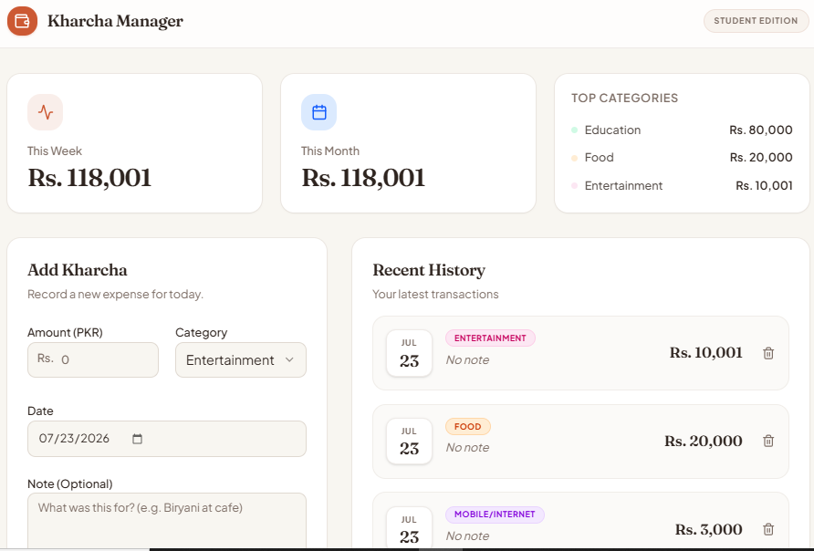

# Kharcha Manager 💰

A simple, friendly expense tracker built for Pakistani university and hostel students to understand and control their daily spending — with an AI "Dost" (friend) that gives personalised saving advice based on real spending patterns.

## The Problem

Most students living away from home (in hostels or on a monthly allowance) lose track of where their money goes each month. There's no simple, judgment-free tool made for their context — Pakistani currency (PKR), local categories (hostel food, mobile packages, rickshaw fare), and practical, non-generic advice. Kharcha Manager solves this by letting students log expenses in seconds and get AI-powered, locally-relevant saving tips.

**Who it's for:** University/college students in Pakistan managing a limited monthly budget.

## 🔗 Live App

**[https://student-budget-pal--baig844.replit.app](https://student-budget-pal--baig844.replit.app)**

## ✨ Features

- **Add expenses** — amount (PKR), category (Food, Transport, Mobile/Internet, Entertainment, Education, Other), date, and an optional note
- **Expense list** — all expenses shown newest-first
- **Delete expenses** — remove any entry with one click
- **Spending summary** — automatic totals for This Week and This Month
- **Category breakdown** — see exactly which category is eating up the budget
- **AI "Dost Advice"** — one-click button that analyses all logged spending and returns friendly, practical saving tips
- **Persistent storage** — all data is saved in a real database, so nothing is lost on refresh
- **Mobile-friendly UI** — clean, simple design that works well on phones

## 🤖 The AI Feature

**What it does:** The "Dost Advice" button sends a summary of the student's spending (total, transaction count, and a category-by-category breakdown) to an AI model, which returns 3–5 personalised, practical saving tips — written in a warm, encouraging tone, with suggestions relevant to Pakistani student life (hostel food, rickshaw vs. bus, mobile packages, etc.).

**Model used:** `nvidia/nemotron-3-ultra-550b-a55b:free` via the OpenRouter API.

**System prompt used:**

```
You are a friendly financial advisor helping Pakistani university students manage their money better.

Here is the student's recent expense data:
Total spent: Rs. {total}
Number of transactions: {count}
Spending by category:
{category breakdown}

Please analyze their spending patterns and give 3–5 personalised, practical, and friendly saving tips in simple English.
- Point out which category they're overspending in (if any) and why it matters for a student on a budget.
- Give concrete, actionable suggestions relevant to a Pakistani student (e.g. mention local context like hostel food, rickshaw vs. bus, mobile packages, etc.).
- Keep the tone encouraging and supportive, not judgmental.
- Format your response as clear paragraphs or a short numbered list. Do not use markdown headers.
```

## 🛠️ Tools, Services & Models Used

- **App builder / hosting:** Replit (Agent for development, Replit Deployments for hosting)
- **Frontend:** React + Vite
- **Backend:** Express (Node.js/TypeScript)
- **Database:** PostgreSQL (Replit-managed)
- **AI Provider:** OpenRouter API
- **AI Model:** nvidia/nemotron-3-ultra-550b-a55b:free
- **Version control:** Git + GitHub

## 📸 Screenshots




## 🚀 How to Run This Project

### Option 1: Use the Live App
Just open the live URL above — no installation needed.

### Option 2: Run Locally
1. Clone this repository:
   ```
   git clone https://github.com/baig844-design/Student-Budget-Pal.git
   ```
2. Install dependencies:
   ```
   pnpm install
   ```
3. Set up environment variables (create a `.env` file):
   ```
   DATABASE_URL=your_postgresql_connection_string
   OPENROUTER_API_KEY=your_openrouter_api_key
   ```
4. Run the development server:
   ```
   pnpm dev
   ```
5. Open the app in your browser at the local address shown in the terminal.

